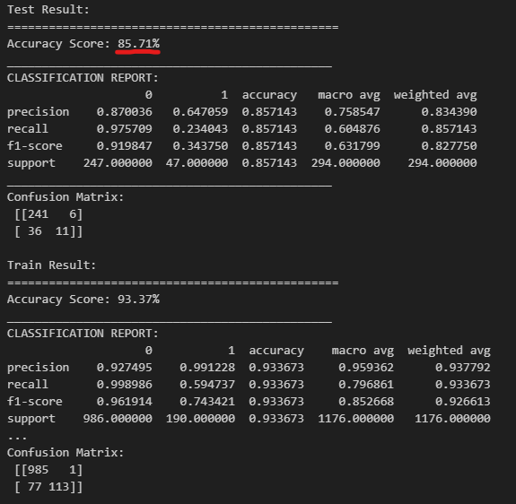
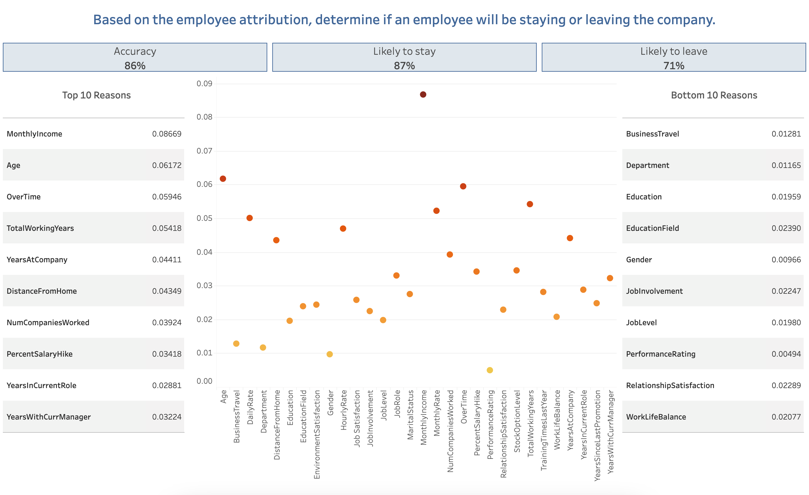

# Predicting Employee Attrition Using Machine Learning

## Introduction
Employee attrition is defined as the loss of staff in a company that may be due to various reasons. 
There are three types of employee attrition: 
* Voluntary Attrition
    This is mainly due to the personal choice of the staff. This can range from having an old age and being due for retirement or simply resigning due to other opportunities available.

* Involuntary Attrition
    This type of attrition is mainly due to the employer's decision. The most common example of this type is contract termination, which can have various reasons such as incompetency at work, sanction for misconduct, or getting redundant due to structural reorganisation of the company.
    
* Internal Attrition
    This happens within the company, wherein the staff moves from one department or role to another. This is the best type of attrition as people are being moved to a role or department where they can be more productive. 

According to Hays Salary Guide 2022-2023, there is a 58% increase in staff turnover for employers and the main reasons for these are:
* Uncompetitive Salary 
* Lack of Promotional Opportunities
* Poor Management Style and Work Culture

## Project Overview
Considering the given information about attrition, the aim of this machine learning (ML) project is to identify who among the current employees is likely to stay with the company or not. 

The ML web app can be used to predict if an employee is likely to stay or not. Using the data from [Kaggle](https://www.kaggle.com/datasets/pavansubhasht/ibm-hr-analytics-attrition-dataset), the ML model will be trained and tested to achieve the most optimal accuracy. The user will then input the employee details in the ML web app and run it to predict employee attrition. 

## Tools and Installations
To run and deploy this project properly, this requires the following:
- [Python](https://www.python.org/)
- [Pandas](http://pandas.pydata.org/)
- [Matplotlib](http://matplotlib.org/)
- [Scikit-Learn](http://scikit-learn.org/stable/)
- [Streamlit](https://streamlit.io/)
- [Tableau](https://www.tableau.com/)

## Machine Learning Process

First, the dataset is preprocessed by cleaning up the data, transforming categorical data into numerical, and then splitting them into Train and Test. Attrition is set as the Target Variable, which is what we are predicting using this ML project: 0 - likely to stay & 1 - likely to leave 

Using the Random Forest machine learning model, the train data are fitted into it, followed by the test data. The score results were printed for both the Train and Test data, focusing on the model's Accuracy Score, which our aim to have higher than 75%. After the initial run, the model will be optimised by doing the following:
* Feature Engineering
    * Only the Top 10 Features are considered:
        1. Monthly Income 
        2. Age
        3. Over Time
        4. Total Working Years
        5. Years at the Company
        6. Distance from Home
        7. Number of Companies Worked
        8. Percent Salary Hike
        9. Years in Current Role
        10. Years with Current Manager

* Optimising Hyperparameters
    1. n_estimators
    2. max_depth
    3. random_state
    4. min_samples_leaf
    5. criterion

Once the model was optimised, it was then deployed in a web app using Streamlit.

## Results
This Tableau dashboard shows the accuracy of the model (86.85%) and its precision scores to predict those staying (0 - 87%) and leaving (1 -71%)

This also shows the Top 10 reasons the employees are considering in their decision to stay or leave the company. The Bottom 10 reasons are also shown for reference.

Other sample visualisations are also done in Tableau to showcase the relationship of specific attributes with employee attrition. As an example:

### Age vs Attrition

It can be observed that the younger staff (18 to early-mid 20s) have a high attrition rate. This can be attributed to the fact that they are new to the workforce and they do not have enough reason to stay in a single employer as they are still trying to find what will work best for them. 

On the other hand, those that are in their mid-20s to early-40s have also a quite significant attrition rate as this is the period in their lives that they prioritise their career growth and will go to where there are more opportunities.

 Attrition rate has significantly decreased around the mid-40s to early-50s. Those who are leaving, if not due to personal reasons, are highly likely that are staying because of the comfort and job security that their employers are providing them.

 Lastly, for those in the age range of late-50s and above, there is a significantly low attrition rate as this is the retiring age and aged staff usually prefer staying in the current company that they are in as that is the last stage of their career.

## Running the ML Web App
[insert something here]

